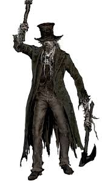
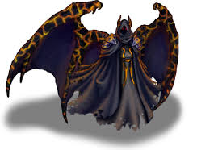

# Visitor exercises

A long time ago in a galaxy far away ...

there was a small village with an even smaller army.
They all lived a happy live until a meteor packed with evil creatures crashed into their planet.
At first the creatures didn't seem to notice the village, because there was more then enough food in the forest.
But that soon changed ...

The first creature was an adventurer and soon discovered the village. He was the most fierce one.
His name was ....
Puss in boots

## Exercise 1
* Create a PussInBootsVisitor
* Whats different about puss in boots?
    - attacks every infanterie 2 times (because 2 paws)
    - attacks in a certain order archer > soldier > captain
    - attack points: 6
    - health points: 30
    - will flee when his health is below 10
    - every time he plunders and survives a round he takes somewhere between 5-10 gold
 
The second creature used to be one of the villagers who got bitten by a foul creature.
He was still ugly and smelly. Although he wasn't really the same person as before. 
I dont think he ever forgave the soldier for taking his old spot.

    
## Exercise 2
* Create a ZombieVisitor
* Whats different about zombie boss?
    - attacks soldier 2 time (because issues), attacks everyone else once (low agility)
    - attacks in a certain order soldier > captain > archer
    - attack points: 10
    - health points: 40
    - doesnt know how to give up
    - every time he plunders and survives a round he takes somewhere between 1-5 gold
 
The third creature was the one everyone feared, because nobody could live and tell the tale after they met him.
There were rumours that he devoured entire armies at once, but still ... no one knew for sure. 

    
## Exercise 3
* Create a ReaperVisitor
* Whats different about the reaper?
    - attacks everyone at once
    - but (still) in a certain order captain > soldier > archer
    - attack points: 7
    - health points: 35
    - regen health with 20 on kill
    - every time he plunders and survives a round he takes somewhere between 10-15 gold
